# Лабораторная работа №1. Работа с сокетами

**Студентка:** Мкртчян Карина, группа K3341
**Язык:** Python 3.14, библиотеки: `socket`, `threading`, `urllib.parse`, `html`

## Цель работы

Написать клиентскую и серверную части приложений, которые обмениваются данными по протоколам UDP, TCP и HTTP с помощью библиотеки `socket`.

## Используемые протоколы

### Сокет

Сокет — объект, через который процесс отправляет и получает данные по сети. Сокет создаётся
на пару чисел: IP-адрес и порт. Порт — число от 0 до 65535, на одном порту может работать
только один процесс-сервер.

`AF_INET` — работа с IPv4-адресами, `SOCK_DGRAM` — датаграммный сокет (UDP),
`SOCK_STREAM` — потоковый сокет (TCP).

Адрес передаётся в виде кортежа `('127.0.0.1', 8888)`. Все приложения в этой работе
запускаются на одном компьютере, поэтому используется адрес `127.0.0.1` — он указывает
на сам компьютер.

### UDP

UDP — протокол без установления соединения. До обмена данными сервер и клиент не
договариваются о соединении: сервер не знает адрес клиента заранее, клиент не сообщает серверу
о своём подключении. Каждый вызов отправки — это отдельный пакет (датаграмма).

Свойства UDP:

- доставка пакета не гарантируется;
- порядок пакетов не гарантируется;
- один пакет не может превышать ограниченный размер;
- соединение не нужно: сервер не пишет `listen` и `accept`, клиент не пишет `accept`.

Работа сервера: `bind` — занять порт, дальше бесконечный цикл `recvfrom` (получить пакет
и адрес отправителя) и `sendto` (отправить ответ по этому же адресу).

Работа клиента: `sendto` — отправить, `recvfrom` — получить ответ.

В клиенте задания 1 дополнительно вызывается `connect`. Для UDP это не установление
соединения: сетевого обмена при этом не происходит, программа просто запоминает адрес
сервера, и после этого в `sendto` его можно не указывать.

### TCP

TCP — протокол с установлением соединения. До обмена данными стороны отправляют друг другу
три сегмента: `SYN`, `SYN + ACK`, `ACK`. После этого соединение считается установленным,
и по нему можно передавать данные.

Свойства TCP:

- соединение устанавливается до обмена данными и закрывается после;
- данные передаются потоком байтов без границ сообщений: один вызов `recv(1024)` может
  вернуть часть сообщения или сразу несколько сообщений;
- порядок переданных данных сохраняется, потеря и повреждение данных обнаруживаются и
  исправляются на уровне TCP.

Работа сервера: `bind` — занять порт, `listen` — перейти в режим ожидания, `accept` — блокирует
программу до появления клиента и возвращает новый сокет для этого клиента, `close` — закрыть
соединение.

Работа клиента: `connect` — установить соединение, `sendall` — отправить все байты,
`recv` — получить данные, `close` — разорвать соединение.

Используется `sendall`, а не `send`, потому что `send` отправляет только столько байт,
сколько поместилось в буфер сокета, а `sendall` повторяет отправку до конца.

Если соединение закрыто, `recv` возвращает пустой набор байтов (`b''`) — это признак того,
что клиент отключился.

### HTTP

HTTP — текстовый протокол поверх TCP. Один HTTP- запрос занимает одно TCP-соединение, по
умолчанию используется порт 80, для локального запуска — 8080.

Запрос состоит из трёх частей, разделённых пустой строкой `\r\n\r\n`:

```
GET /submit HTTP/1.1        <- строка запроса: метод, путь, версия протокола
Host: 127.0.0.1:8080        <- заголовки
Content-Type: application/x-www-form-urlencoded
Content-Length: 27
                            <- пустая строка: конец заголовков
subject=%D0%9C%D0%B0%D1%82  <- тело запроса
```

Ответ устроен так же:

```
HTTP/1.1 200 OK             <- строка состояния: версия, код, текст
Content-Type: text/html; charset=utf-8
Content-Length: 880
Connection: close
                            <- пустая строка: конец заголовков
<!DOCTYPE html>...          <- тело ответа
```

## Задание 1. UDP: клиент и сервер

**Что делает.** Клиент отправляет серверу сообщение `Hello, server!`, сервер отвечает
`Hello, client!`. Обмен повторяется 5 раз.

**Как устроено.** Сервер занимает порт 8888 и в цикле вызывает `recvfrom`, из результата
берёт адрес отправителя и отправляет ему ответ через `sendto`. Сервер не хранит подключённых
клиентов: адрес он получает из каждого пакета.

**Скриншот 1.** Терминал с запущенным сервером задания 1: видно строку о запуске и пять
принятых сообщений.

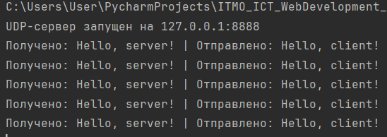

**Скриншот 2.** Терминал с запущенным клиентом задания 1: пять строк «Отправлено /
Получено».

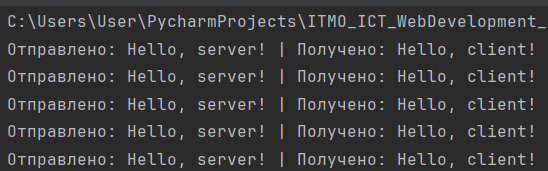

## Задание 2. TCP: клиент и сервер

**Что делает.** Клиент вводит с клавиатуры параметры операции, сервер считает и отвечает.
Обрабатываются два случая:

- два числа `a h` — площадь прямоугольника, `a * h`;
- три числа `a b угол` — площадь параллелограмма со сторонами `a` и `b` и углом между ними,
  `a * b * sin(угла)`. Угол вводится в градусах, поэтому перед вычислением он переводится
  в радианы функцией `radians`.

Если число не три, приходит ответ с требованием ввести два или три числа. Если строка не
числовая — с требованием ввести числа.

**Как устроено.** Сервер слушает порт 8888, принимает одно подключение через `accept` и
работает с ним в цикле, пока клиент не введёт `exit`. Строка от клиента разбивается на
части по пробелу, результат отправляется обратно через `sendall`.

**Скриншот 3.** Терминал с клиентом задания 2: ввод параметров и ответы сервера, в том
числе ответы на ошибочный ввод.

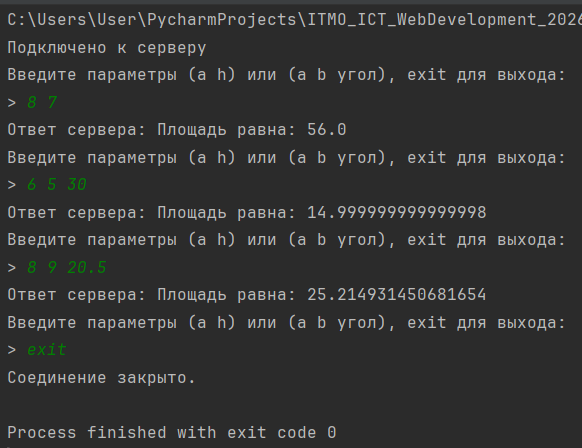

**Скриншот 4.** Терминал с сервером задания 2: строка о подключении клиента.

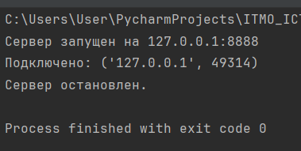

## Задание 3. HTTP-сервер, отдающий страницу из файла

**Что делает.** Сервер читает файл `index.html` из своей папки и отдаёт его клиенту как
HTML-страницу: клиентом может быть браузер или командная строка.

**Как устроено.** Файл читается один раз при запуске сервера. Заголовки ответа собираются
в строку, к ним добавляется содержимое файла — так получается готовый ответ. Один и тот же
готовый ответ отправляется каждому подключившемуся клиенту. Перед отправкой сервер читает
запрос клиента (`recv`), чтобы освободить входной буфер сокета.

Путь к файлу строится от папки самого скрипта через `os.path.dirname(os.path.abspath(__file__))`,
поэтому сервер запускается из любой директории, а не только из своей папки.

**Скриншот 5.** Браузер с адресом `http://127.0.0.1:8080/`, на вкладке отображается
страница из `index.html`.

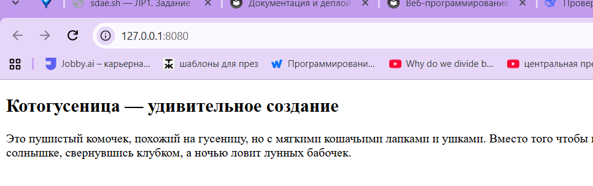

**Скриншот 6.** Терминал.

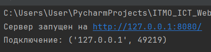

## Задание 4. Многопользовательский чат

**Что делает.** Несколько клиентов подключаются к одному серверу, вводят имя и обмениваются
сообщениями: всё, что пишет один клиент, видят остальные. Команда `/quit` завершает работу
клиента.

**Как устроено.** Сервер хранит словарь `clients`, где ключ — сокет подключения, значение —
имя. Словарь общий для всех потоков, поэтому каждый доступ к нему берётся под блокировкой
`threading.Lock`.

На каждое подключение создаётся отдельный поток с функцией `handle_client`: она запрашивает
имя, добавляет клиента в словарь, сообщает остальным о его входе, затем в цикле читает
сообщения и рассылает их через `broadcast` всем, кроме отправителя. Потоки созданы как
демоны (`daemon=True`), поэтому они не мешают завершиться программе.

Когда соединение закрыто, `recv` возвращает `b''`, и поток выходит из цикла, удаляет
клиента из словаря и сообщает остальным о его уходе. Эта же последовательность выполняется
при получении `/quit` и при обрыве связи.

Клиент тоже многопоточный: в отдельном потоке работает `receive_loop`, который печатает
сообщения сервера, а в главном потоке идёт ввод с клавиатуры. Так входящие сообщения
не занимают строку ввода.

**Пример работы в терминале**

Сервер запускается в первом окне, клиенты — в двух других.


**Скриншот 7.** Терминал сервера задания 4: подключение двух клиентов, вход в чат,
переписка и отключение.

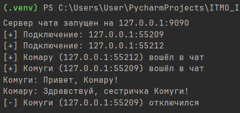`

**Скриншот 8.** Терминал клиента «Комуги»: приветствие сервера, счётчик участников,
сообщение от второго клиента, выход по `/quit`.

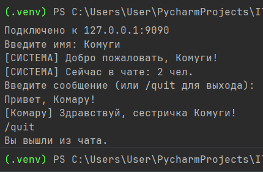

**Скриншот 9.** Терминал клиента «Комару»

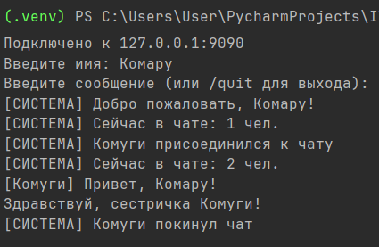

## Задание 5. Веб-сервер: журнал оценок

**Что делает.** Сервер обрабатывает два запроса:

- `GET /` — вернуть HTML-страницу со всеми оценками, сгруппированными по дисциплине, и
  формой для добавления новой оценки;
- `POST /submit` — принять дисциплину и оценку из формы, сохранить их и перенаправить
  браузер на `GET /`.

Оценки хранятся в словаре `journal`, где ключ — дисциплина, значение — список оценок.
Это обычный словарь в памяти программы, база данных не используется. Счётчик участников
не нужен, сервер однопоточный.

**Как устроено.** Запрос читается вручную, без библиотек HTTP:

1. `read_request` накапливает байты в буфере, пока не встретит `\r\n\r\n` — конец
   заголовков. Так как TCP не соблюдает границы сообщений, заголовки могут прийти
   несколькими частями.
2. Первая строка разбивается на метод, путь и версию протокола. Остальные строки
   разбираются в словарь заголовков, ключи приводятся к нижнему регистру.
3. Для `POST` тело дочитывается до конца по заголовку `Content-Length`.
4. `route` выбирает ответ по методу и пути.
5. `build_response` собирает ответ: строка состояния, заголовки, пустая строка, тело.

Проверка входных данных: дисциплина не должна быть пустой, оценка должна быть целым числом
от 1 до 5. При нарушении возвращается `400 Bad Request` и данные в журнал не попадают.
Любой другой путь возвращает `404 Not Found`.

Дисциплина приходит от пользователя и подставляется в HTML, поэтому перед вставкой она
обрабатывается функцией `html.escape`, которая заменяет спецсимволы на их коды. Без этого
введённый в поле текст вроде `<b>жирный</b>` сломал бы разметку страницы.

У соединения стоит таймаут 10 секунд: однопоточный сервер не должен зависать, если клиент
подключился и не отправил запрос.

**Скриншот 10.** Браузер с адресом `http://127.0.0.1:8080/`: пустой журнал и форма
«Добавить оценку» с полем дисциплины и выбором оценки.

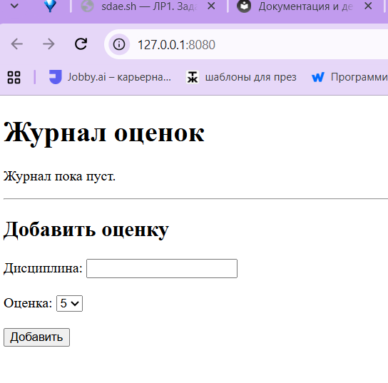

**Скриншот 11.** Та же страница в браузере после добавления оценок: таблица со строками
по дисциплинам, количеством оценок и средним баллом.

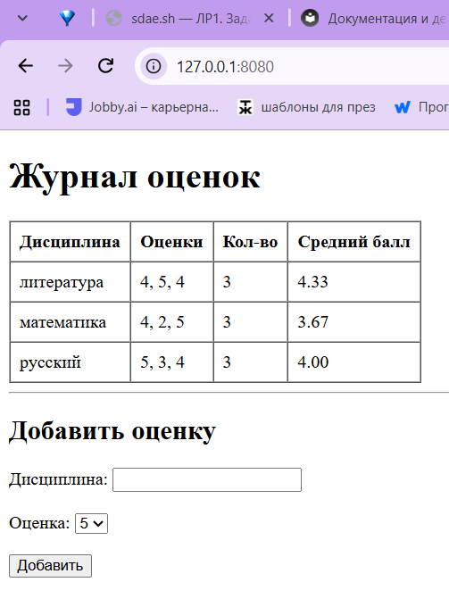

**Скриншот 12.** Вывод в терминале.

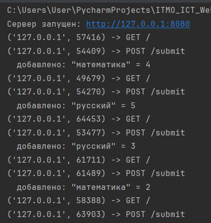